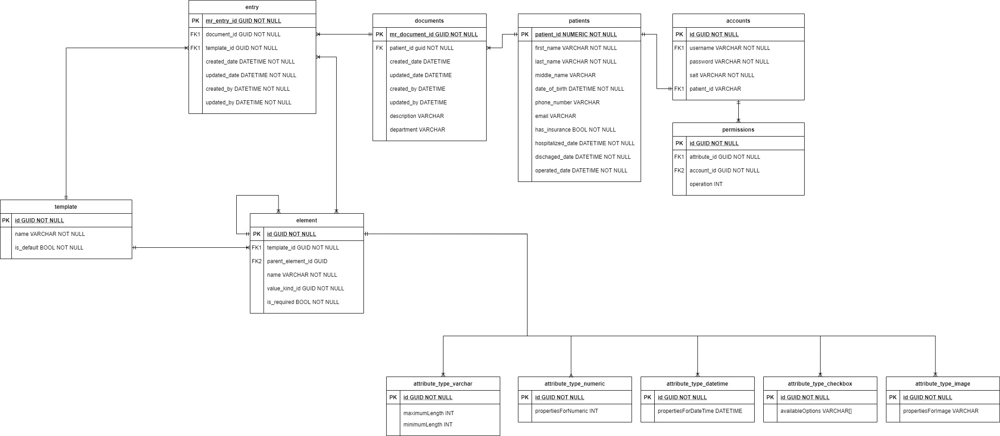
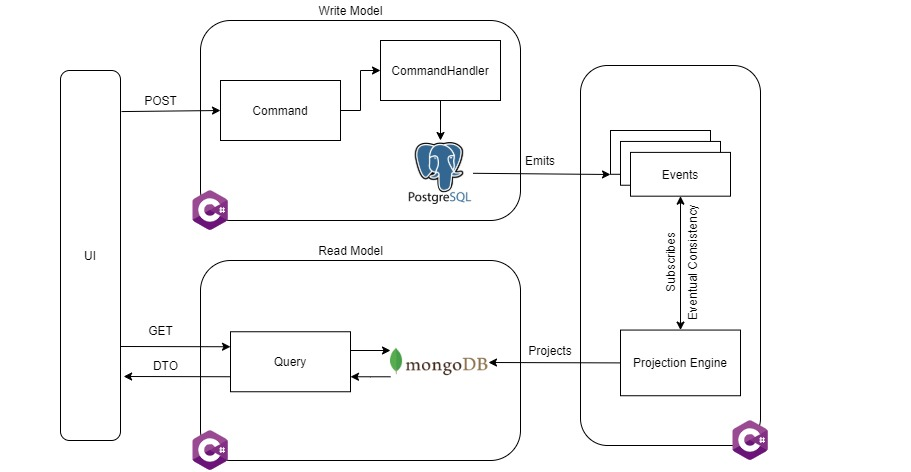

## About The Project
Electronic Medical Records for VD hospital. Reduce time when for old patient's records lookup, hence improve the ability to continuous examination and treatment 

In order to create the flexibility of medical record template for each department within hospital, several techniques are applied to create dynamic template. So that, when requirements within a department is changed (add new checkbox, add new field, etc...) instead of having developers change the form inside the database structure, refactor all over upper layers, this application gives doctor/user the ability to define templates by themselves.

### Built With
* [.NET 5.0](https://docs.microsoft.com/en-us/aspnet/core/?view=aspnetcore-5.0)
* [PostgreSQL](https://www.postgresql.org/)
* [MongoDB](https://www.mongodb.com/)

## Architecture Overview

Though there is a lot of ideas and small techniques are used for this project, but those are the 'honorable mentions':

### EAV Model

The idea behind having Dynamic Template comes from the design idea of eCommerce's product portfolio a.k.a [EAV-model](https://en.wikipedia.org/wiki/Entity%E2%80%93attribute%E2%80%93value_model)). Terminology from EAV-model suits with Dynamic Template by: 

### CQRS Pattern

One of the biggest drawbacks when having EAV-model within a system is performance, because getting data out takes a lot of table joins operation. Having [CQRS pattern]("https://martinfowler.com/bliki/CQRS.html") is quite a good choice to come along with EAV-model (only CQRS, not Event Sourcing) since this pattern provide performance when seperate application into 2 seperate read/write models. Storing dyamic form inside RDBMS using EAV can only leverage ACID compliant, meanwhile, NoSQL Database (in this application, it's MongoDB) can improve the speed of read when recursive structures stored within RDBMS are converted into NoSQL structures.

